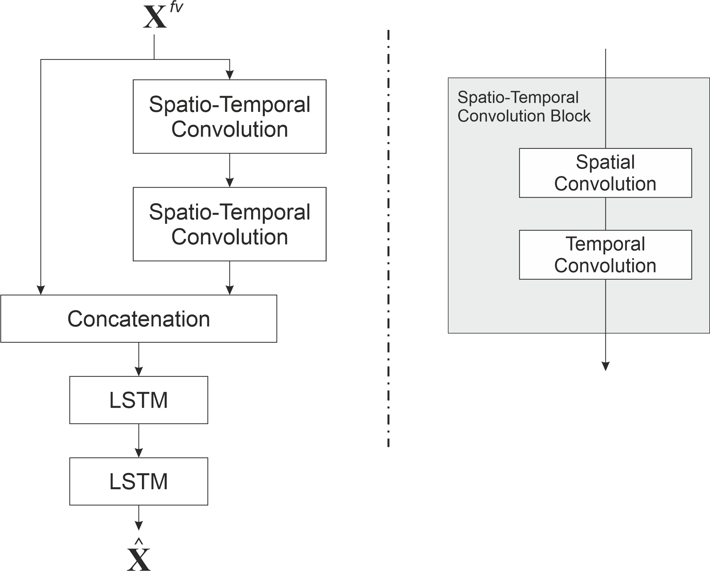

# STGCN-LSTM
Hybrid Spatial-Temporal Graph Convolutional Network with LSTM layers


# Requirements
Tested in the following environment
+ python 3.8
+ keras 2.4.3
+ tensorflow 2.3.0

# Usage

To train the model, existed configuration files can be used.
Train / validate model on PEMS04 dataset:
```
python main.py --config config/PEMSD7M_STGCN.conf --force True
```
